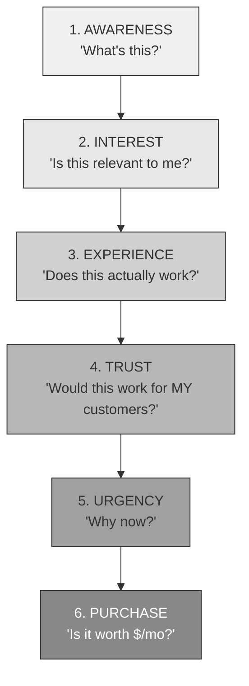
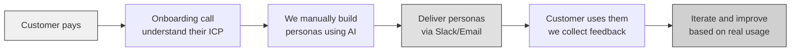
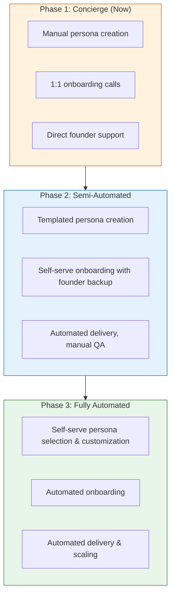

# Customer Purchase Journey

**Last updated:** 2026-02-10

## Core Strategy: Sell Before Build

We validate demand with real payments before investing in building the full product. When someone pays, we deliver a **concierge version** (manually creating personas using AI) while automation is being built.

This document maps the full customer journey from discovery to purchase and defines what we need at each stage.

---

## The Funnel

---

## 1. AWARENESS — "What's this?"

They discover Refolk exists.

**What we need:**

- LinkedIn posts targeting PMMs, product managers, and early-stage founders
- Targeted content in communities where they hang out (Lenny's, Product Hunt, indie hacker forums, Slack groups)
- Content that leads with the problem, not the product — "How do you know your messaging will land before you spend $10k on ads?"

**Key channels:**

- LinkedIn (organic posts, not ads — yet)
- Twitter/X product communities
- Founder/PMM Slack groups and Discord servers
- Product Hunt (when demo is polished)

---

## 2. INTEREST — "Is this relevant to me?"

They visit refolk.co and read the pitch.

**What we need:**

- Landing page with a clear value prop — not "AI personas" but **"test your messaging before wasting ad spend"**
- Immediately communicate what this is and who it's for
- Show, don't tell — hint at the depth of personas without overwhelming

**The pitch isn't about the technology.** It's about the outcome: confident messaging decisions without expensive, slow research.

> For messaging and value prop details, see [value-prop.md](./value-prop.md).

---

## 3. EXPERIENCE — "Does this actually work?"

They try an interactive demo.

**What we need:**

- Interactive demo on the landing page — let them talk to a sample persona and feel the "aha" moment
- The demo IS the product for now — make it incredible
- Low friction: no signup, no email gate, just type and get a response
- The response quality should make them think "wait, this is actually useful"

**The demo is our most important asset.** If the demo doesn't convert, nothing downstream matters. Every minute spent improving demo quality is worth more than any other marketing investment right now.

**Demo requirements:**

- Instant response (no loading screens, no "generating...")
- Persona response must feel distinct and human — not generic AI
- Show the persona's context naturally through their response
- Let the visitor ask follow-up questions

---

## 4. TRUST — "Would this work for MY customers?"

They believe it works, but need to see it work for their specific use case.

**What we need:**

- Show persona customization options — "these aren't just our personas, we can build yours"
- Industry-specific examples (SaaS, e-commerce, fintech, etc.)
- An "upload your ICP and see a preview" flow — even if manual on the backend
- Social proof as soon as we have it (early customer quotes, case studies)

**Trust-building tactics:**

- Show the range of persona types available
- Let them describe their customer and see a preview response
- Founder availability — "book a call, I'll walk you through it" (early stage advantage)

---

## 5. URGENCY — "Why now?"

They feel the cost of NOT having it.

**What we need:**

- Frame the cost of bad messaging:
  - Wasted ad campaigns ($5k-$50k on messaging that doesn't resonate)
  - Missed positioning (competitor ships while you're still researching)
  - Building the wrong thing (months of dev time on features nobody wants)
- Early access framing — this price won't last

**Urgency levers:**

- "Every week you ship untested messaging is a week of wasted budget"
- "Your competitors are already testing — are you?"
- Early access pricing — current prices are the lowest they'll ever be

---

## 6. PURCHASE — "Is it worth $/mo?"

They commit via Stripe checkout.

**What we need:**

- Frictionless Stripe checkout — as few clicks as possible
- Early-access framing — buyers get in at the lowest price before it goes up
- Founder's discount or launch pricing to reduce hesitation
- Clear "what happens next" after payment (onboarding, timeline to first persona)

**Purchase experience:**

- Simple plan selection (no confusing options)
- Checkout → confirmation → onboarding email within minutes
- Set expectations: "Your personas will be ready within 48 hours"

> For pricing tiers and philosophy, see [pricing-strategy.md](./pricing-strategy.md).
> For CTA best practices on the purchase flow, see [cta-guidelines.md](./cta-guidelines.md).

---

## Key Tactics

| Tactic                                 | Why it matters                                                                           |
| -------------------------------------- | ---------------------------------------------------------------------------------------- |
| Frame pricing as early access          | Buyers get in cheap before prices go up — creates urgency and rewards early adopters     |
| Concierge delivery for early customers | Every sale = validation + revenue + a case study                                         |
| Demo is the product for now            | The "aha" moment sells — invest everything in demo quality                               |
| Founder's personal touch               | Early stage advantage — direct access to the founder builds trust and generates feedback |

---

## Sell Before Build Philosophy

### Why this approach

- **Capital efficient** — revenue before engineering investment. We don't build features nobody wants.
- **Validates demand** — real payments are the strongest signal. Signups and waitlists lie. Credit cards don't.
- **Reduces risk** — if nobody buys, we learn that cheaply. If people buy, we know exactly what to build.
- **Generates case studies** — every concierge customer becomes a reference and a source of product insight.

### How concierge delivery works

1. **Customer pays** — Stripe checkout, they're committed
2. **Onboarding call** — understand their target audience, use cases, what questions they want answered
3. **We build their personas** — manually, using AI tools, with the same depth and rigor as our pre-built roster
4. **Deliver within 48 hours** — personas available in their chosen channels (Slack, email)
5. **Collect feedback** — what worked, what didn't, what they wish was different
6. **Iterate** — improve the personas and our process based on real usage data

### Transition plan: concierge to automated

**Phase 1 → Phase 2 trigger:** ~10-20 paying customers. At this point we'll have enough pattern recognition to templatize persona creation and streamline onboarding.

**Phase 2 → Phase 3 trigger:** ~50+ customers. At this point the process should be well-understood enough to fully automate, and revenue justifies the engineering investment.

**What stays manual longest:** Custom persona development for Team/Enterprise customers. This is high-touch, high-value, and doesn't need to be automated early.

---

## Related Documentation

- **Value Proposition:** [value-prop.md](./value-prop.md) — messaging framework and differentiation
- **Pricing Strategy:** [pricing-strategy.md](./pricing-strategy.md) — tiers, philosophy, and what's included
- **CTA Guidelines:** [cta-guidelines.md](./cta-guidelines.md) — CTA principles for each stage of the funnel
- **How It Works:** [how-it-works-rewrite.md](./how-it-works-rewrite.md) — the post-purchase user flow
